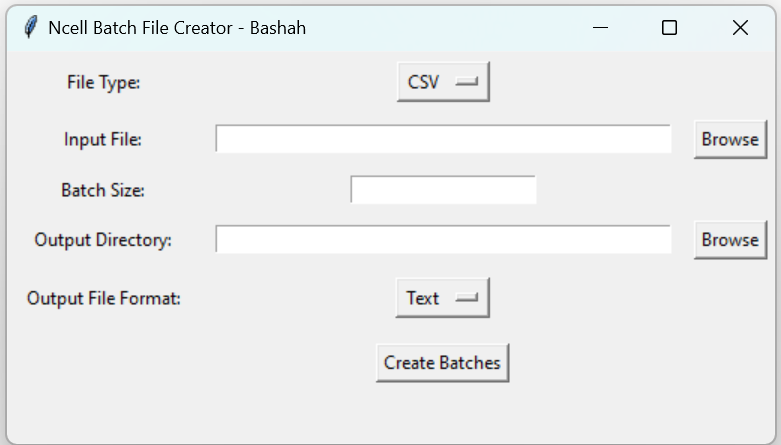

# File Splitter

File Splitter is a simple Python application that allows users to split large files into smaller batches. It provides a graphical user interface (GUI) for selecting the input file, setting the batch size, choosing the output directory, and selecting the output file format.

## Features

- Split large files into smaller batches based on user-defined batch size.
- Supports various file formats including CSV, Excel, SQL and Text.
- Provides a user-friendly GUI for easy interaction.
- Prevents resizing of the window to maintain a consistent user experience.

## Requirements

- Python 3.x
- pandas library

## Installation

1. Clone the repository to your local machine:

git clone https://github.com/your-username/ncell-file-splitter.git

2. Install the required dependencies:

pip install pandas

## Usage

1. Run the application:

python main.py

2. Select the input file by clicking on the "Browse" button next to the "Input File" field.

3. Set the batch size according to your requirements.

4. Choose the output directory where the batch files will be saved.

5. Select the output file format from the dropdown menu.

6. Click on the "Create Batches" button to split the file into batches.

## Screenshots

## License

## Acknowledgements

- This project was inspired by the need to split large files efficiently for processing.
